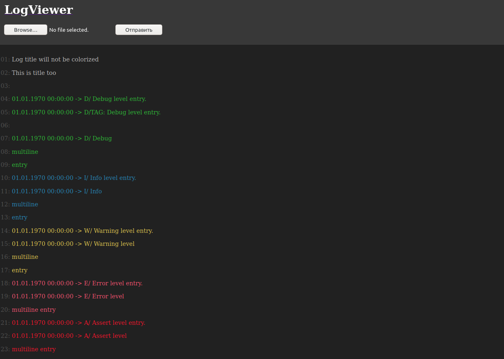

# LogViewer

Tiny application I created to colorize log files. Application uses following regular expressions to colorize file:
  - DEBUG level entry: `^\d\d.\d\d.\d\d\d\d \d\d:\d\d:\d\d -> D/`;
  - INFO level entry: `^\d\d.\d\d.\d\d\d\d \d\d:\d\d:\d\d -> I/`;
  - WARNING level entry: `^\d\d.\d\d.\d\d\d\d \d\d:\d\d:\d\d -> W/`;
  - ERROR level entry: `^\d\d.\d\d.\d\d\d\d \d\d:\d\d:\d\d -> E/`;
  - ASSERT level entry: `^\d\d.\d\d.\d\d\d\d \d\d:\d\d:\d\d -> A/`;

Colorize example:
```    
Log title will not be colorized
This is title too

01.01.1970 00:00:00 -> D/ Debug level entry.
01.01.1970 00:00:00 -> D/TAG: Debug level entry.

01.01.1970 00:00:00 -> D/ Debug
multiline
entry
01.01.1970 00:00:00 -> I/ Info level entry.
01.01.1970 00:00:00 -> I/ Info
multiline
entry
01.01.1970 00:00:00 -> W/ Warning level entry.
01.01.1970 00:00:00 -> W/ Warning level
multiline
entry
01.01.1970 00:00:00 -> E/ Error level entry.
01.01.1970 00:00:00 -> E/ Error level
multiline entry
01.01.1970 00:00:00 -> A/ Assert level entry.
01.01.1970 00:00:00 -> A/ Assert level
multiline entry
```

becomes



## Stack
Application uses Kotlin with Ktor framework and Freemarker to create HTML template.